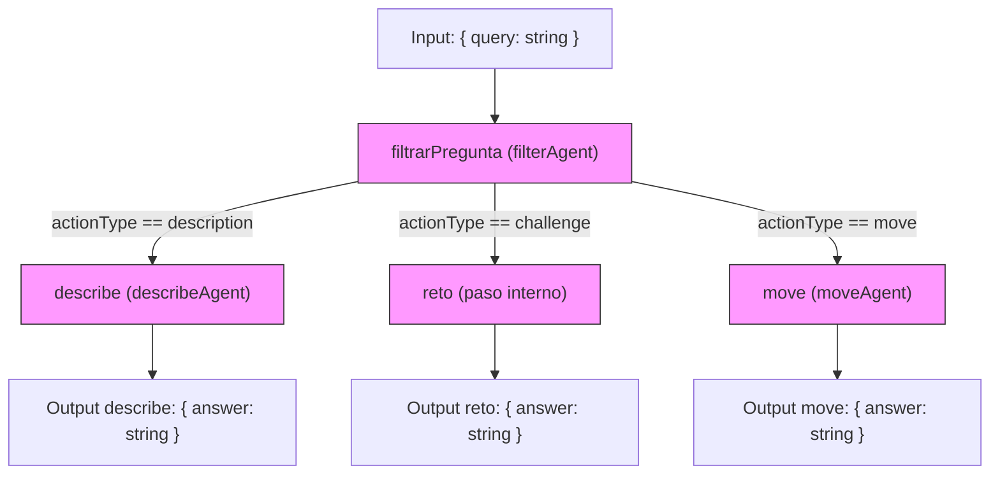

# Action Workflow — IAdventureMastra

Este README describe el workflow `actionWorkflow` definido en `src/mastra/workflows/principal.ts`.
Explica los pasos, los esquemas (Zod) y muestra un diagrama Mermaid para entender el flujo. También incluye ejemplos de salida JSON esperada cuando los agentes usan `structuredOutput`.

---

## Resumen

`actionWorkflow` procesa una consulta de usuario (`query`) y delega en un agente `filterAgent` para clasificar la intención (actionType). En función de la clasificación el flujo ramifica a uno de estos pasos:

- `describe` — Genera una descripción.
- `reto` — Genera un reto/ejercicio.
- `move` — Genera una respuesta relacionada con movimiento en el juego.

Cada paso utiliza esquemas Zod para validar su entrada y salida y, cuando corresponde, llama a un agente con `structuredOutput` para obtener un JSON validado.

---

## Diagrama del flujo (Mermaid)



---

## Esquemas (Zod) importantes

En `principal.ts` se usan varios esquemas Zod. Los principales son:

- `schema` (filtrado):

```ts
const schema = z.object({
  actionType: z.enum(["description", "challenge", "object", "move"]),
  query: z.string()
});
```

Se usa en `filtrarPregunta` como `structuredOutput.schema` para pedir al `filterAgent` que devuelva un objeto con esa forma.

- Salida de pasos `describe`, `reto` y `move`:

```ts
z.object({ answer: z.string() })
```

---

## Comportamiento y uso de `structuredOutput`

En esta versión NO realizamos validación automática de la salida del LLM. Los esquemas Zod se mantienen en el repo como referencia sobre la forma esperada, pero las respuestas devueltas por los agentes deben ser inspeccionadas, tipadas o validadas manualmente por el equipo cuando sea necesario.

Cuando llamas a un agente con la opción `structuredOutput` (como en `filterAgent.generate(...)`), el SDK puede devolver la respuesta parseada en `res.result` (o en otro campo según la versión del SDK). En el código del workflow se usa:

```ts
const res = await filterAgent.generate(
  [{ role: 'user', content: inputData.query }],
  { structuredOutput: { schema, jsonPromptInjection: true } }
);

return res.result;
```

Notas importantes (sin validación automática):

- `res` es un objeto con varias propiedades del SDK; la propiedad que contiene la salida estructurada en este proyecto es `res.result`.
- No se valida automáticamente que `res.result` cumpla `schema`. Si necesitas trabajar con tipos en TypeScript, puedes usar una aserción o una comprobación manual. Ejemplo rápido:

```ts
type FilterResult = { actionType: 'description' | 'challenge' | 'object' | 'move'; query: string };

const res = await filterAgent.generate(...);

// Asumimos que res.result tiene la forma esperada; esta línea no valida en tiempo de ejecución
const payload = res.result as FilterResult;

if (!payload || typeof payload.actionType !== 'string') {
  throw new Error('Salida inesperada del agente');
}
```

- Para depuración, imprime `res` completo y revisa `res.result`:

```ts
console.log(JSON.stringify(res, null, 2));
```

---

## Ejemplo de input y salida

Input:

```json
{ "query": "¿Cómo puedo moverme al norte?" }
```

Flujo (simplificado):

1. `filtrarPregunta` -> `filterAgent` clasifica la intención: `{ actionType: "move", query: "moverme al norte" }`.
2. Se selecciona el paso `move` y se llama a `moveAgent` con `structuredOutput`.
3. `move` devuelve algo como `{ answer: "Te mueves al norte y ves un río." }`.

Salida final (ejemplo):

```json
{ "answer": "Te mueves al norte y ves un río." }
```

Si el workflow está compuesto para devolver varios resultados, su `outputSchema` puede agrupar las salidas.

---

## Buenas prácticas y solución de problemas

- Validación: usa Zod para validar tanto la entrada como la salida de pasos y agentes.
- Debug: imprime `res` completo cuando desarrolles para ver la forma real que devuelve el SDK:

```ts
console.log(JSON.stringify(res, null, 2));
```

- Propiedad correcta: en este repositorio el JSON validado por `structuredOutput` se lee desde `res.result`. Si tu código esperaba `res.result` o `res.output`, actualiza tu acceso para usar `res.result` o inspecciona el objeto `res` para confirmar la propiedad correcta.

- Manejo de errores: comprueba `res` y `res.result` antes de devolverlo para evitar excepciones inesperadas en el workflow.

---

## Referencias

- `src/mastra/workflows/principal.ts` — implementación del workflow y pasos.
- Zod — https://github.com/colinhacks/zod
- Documentación del SDK (si aplica) — revisa cómo tu SDK modela la respuesta de `generate(...)`.

---
